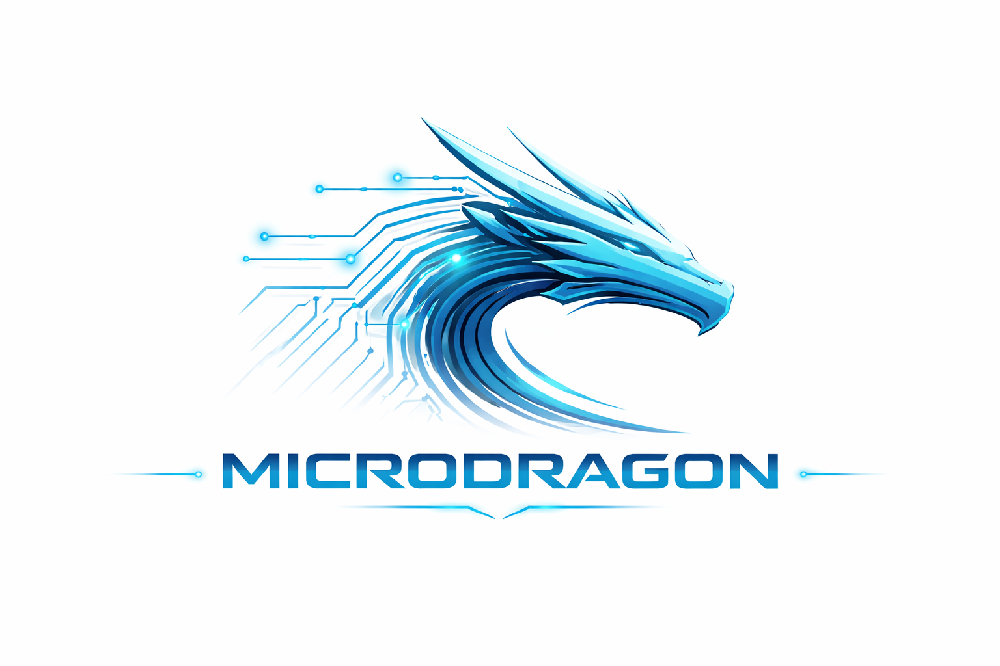

<div align="center">



```
  ███╗   ███╗██╗ ██████╗██████╗  ██████╗ ██████╗ ██████╗  █████╗  ██████╗  ██████╗ ███╗   ██╗
  ████╗ ████║██║██╔════╝██╔══██╗██╔═══██╗██╔══██╗██╔══██╗██╔══██╗██╔════╝ ██╔═══██╗████╗  ██║
  ██╔████╔██║██║██║     ██████╔╝██║   ██║██║  ██║██████╔╝███████║██║  ███╗██║   ██║██╔██╗ ██║
  ██║╚██╔╝██║██║██║     ██╔══██╗██║   ██║██║  ██║██╔══██╗██╔══██║██║   ██║██║   ██║██║╚██╗██║
  ██║ ╚═╝ ██║██║╚██████╗██║  ██║╚██████╔╝██████╔╝██║  ██║██║  ██║╚██████╔╝╚██████╔╝██║ ╚████║
  ╚═╝     ╚═╝╚═╝ ╚═════╝╚═╝  ╚═╝ ╚═════╝ ╚═════╝ ╚═╝  ╚═╝╚═╝  ╚═╝ ╚═════╝  ╚═════╝ ╚═╝  ╚═══╝
```

**Distributed Intelligence Network Operating as Cognitive Local Autonomous Worker**

[](https://www.npmjs.com/package/@ememzyvisuals/microdragon)
[](LICENSE)
[]()
[]()
[]()
[]()
[]()

**Created by [EMEMZYVISUALS DIGITALS](https://ememzyvisuals.com)**
**Emmanuel Ariyo — Founder & CEO**

[npm](https://npmjs.com/package/@ememzyvisuals/microdragon) · [GitHub](https://github.com/Ememzyvisuals/microdragon) · [@ememzyvisuals on X](https://x.com/ememzyvisuals)

</div>

---

## The AI agent that actually does things.

You open your terminal. You type `microdragon`. A full terminal UI launches — real-time pipeline phases, live tool calls, autonomous command execution. Then:

```
  ❯ build a REST API in Python with JWT auth and write it to my Desktop
```

MICRODRAGON doesn't chat back. It:

1. **PERCEIVES** — classifies intent as CODE task
2. **PLANS** — 5-step execution strategy
3. **GATHERS** — recalls relevant patterns from memory
4. **SYNTHESIZES** — enriches context
5. **REASONS** — generates complete production code
6. **REFLECTS** — self-critiques quality (scores 8.4/10)
7. **REFINES** — improves if score < 7/10
8. **FORMATS** — renders with syntax highlighting
9. **COMMITS** — runs `$ mkdir -p ~/Desktop/myapi`, writes all files, runs `$ pip install fastapi`, opens the folder — then stores everything to memory

No subscription. No cloud. Runs on your machine. Free with Groq or Ollama.

**MICRODRAGON = Distributed Intelligence Network Operating as Cognitive Local Autonomous Worker**

---

> **⚡ PUBLIC BETA v0.1.19** — Actively developed. Feature requests via [@ememzyvisuals](https://x.com/ememzyvisuals)

---

## Why MICRODRAGON Is Different

| | MICRODRAGON | OpenCode | Claude Code | Devin |
|---|---|---|---|---|
| **Free option** | ✅ Ollama/Groq, forever | ✅ | ❌ $20+/month | ❌ $20+/month |
| **Fully local** | ✅ | ✅ | ❌ | ❌ |
| **9-phase pipeline** | ✅ | ❌ | ❌ | ❌ |
| **Autonomous shell execution** | ✅ ReAct loop | Partial | ✅ | ✅ |
| **Full terminal TUI** | ✅ ratatui | ✅ | ✅ | ❌ |
| **Real web search** | ✅ Brave/DDG | ❌ | ❌ | ❌ |
| **All domains** | ✅ | Messaging/routing | Code only | Code only |
| **Plays games** | ✅ CV + AI | ❌ | ❌ | ❌ |
| **Creates real files** | ✅ docx/xlsx/pdf/pptx | ❌ | ❌ | ❌ |
| **Design (HTML/SVG/Pillow)** | ✅ | ❌ | ❌ | ❌ |
| **Cybersecurity expert** | ✅ OWASP + SAST | ❌ | Partial | ❌ |
| **Voice (STT + TTS)** | ✅ Whisper + system | ❌ | ❌ | ❌ |
| **Cross-platform memory** | ✅ WhatsApp+TG+Discord | Partial | ❌ | ❌ |
| **Fine-tunes models** | ✅ 3 methods | ❌ | ❌ | ❌ |
| **Source code** | ✅ MIT | ✅ MIT | ❌ | ❌ |

---

## Install

```bash
npm install -g @ememzyvisuals/microdragon
microdragon setup
microdragon
```

**Requirements:** Node.js 18+ · One API key (Groq is free at console.groq.com)

---

## 9-Phase Agentic Pipeline

Every single command runs through all 9 phases — visible in real time:

```
  🐉 Agentic Pipeline
  ▶ 1/9  PERCEIVE    intent=CODE entities=2 tools_needed=shell,filesystem
  ▶ 2/9  PLAN        5 steps: Analyse → Recall → Generate → Run → Verify
  ▶ 3/9  GATHER      Reading file: src/main.py...
  ▶ 4/9  SYNTHESIZE  context_tokens~3200 gathered_bytes=4812
  ▶ 5/9  REASON      model=llama-3.3-70b tokens=1847 latency=2341ms
  ▶ 6/9  REFLECT     score=8.4/10 refine=false
  ▶ 7/9  REFINE      skipped — quality 8.4/10 sufficient
  ▶ 8/9  FORMAT + EXECUTE
         $ mkdir -p ~/Desktop/myapi
         ✓ exit 0 · 12ms
         $ pip install fastapi uvicorn python-jose
         ✓ exit 0 · 8430ms
  ✓      Pipeline complete · groq · 14102ms · 2198 tokens
```

| Phase | What it does |
|---|---|
| **1 PERCEIVE** | Parse intent, classify task type, extract entities (files, symbols, URLs) |
| **2 PLAN** | Build task-specific execution strategy |
| **3 GATHER** | Run real tools: web search (Brave/DDG), file reading, memory recall |
| **4 SYNTHESIZE** | Merge all gathered data into enriched context |
| **5 REASON** | Primary AI generation with full context and agentic system prompt |
| **6 REFLECT** | AI critiques own output: completeness, actionability, structure, accuracy |
| **7 REFINE** | Re-generates if reflection score < 7/10 (skipped if quality is good) |
| **8 FORMAT + EXECUTE** | Renders markdown output, extracts shell commands, runs them autonomously |
| **9 COMMIT** | Persists interaction to SQLite memory, emits telemetry |

---

## Full Command Reference

### Chat & Ask
```bash
microdragon                              # launch full TUI (default)
microdragon --simple                     # plain text mode
microdragon ask "explain RSA encryption"
microdragon ask "latest bitcoin price"
microdragon ask --stream "write a SaaS business plan"
microdragon ask --agent security "audit this JWT implementation"
```

### Code
```bash
microdragon code generate "REST API with JWT in FastAPI"
microdragon code generate "binary search tree" --language rust --output bst.rs
microdragon code debug ./src/main.rs
microdragon code review ./src/
microdragon code test ./src/ --framework pytest
microdragon code git "write commit message for staged changes"
```

### Documents — creates REAL files on your PC
```bash
microdragon document word "project report on MICRODRAGON architecture"
microdragon document excel "startup monthly budget with charts"
microdragon document pdf "research report on quantum computing"
microdragon document pptx "10-slide pitch deck for MICRODRAGON" --slides 10
microdragon document read ./contract.pdf
microdragon document install     # installs python-docx openpyxl reportlab python-pptx
```

### Design — creates REAL design files
```bash
microdragon design html "dark cyberpunk landing page" --style neon
microdragon design svg "MICRODRAGON dragon logo geometric"
microdragon design image "startup poster 1920x1080" --width 1920 --height 1080
microdragon design open ./output.html
```

### File System — navigate and operate anywhere on the PC
```bash
microdragon files overview               # home, desktop, documents paths
microdragon files ls ~/Desktop
microdragon files ls ./src
microdragon files cd ~/Documents
microdragon files read ./main.rs
microdragon files write ./output.txt --content "hello world"
microdragon files mkdir ./myproject/src/modules
microdragon files find ~ .rs             # find all .rs files on the machine
microdragon files find ~/Documents "invoice"
```

### Voice
```bash
microdragon voice say "Good morning. You have 3 tasks today."
microdragon voice listen                 # record 5s, transcribe, get AI response, speak back
microdragon voice listen --duration 15
microdragon voice setup                  # show what TTS/STT is configured
microdragon voice install                # pip install pyaudio faster-whisper
```

### Gaming — MICRODRAGON plays games autonomously
```bash
microdragon game install                 # pip install mss pynput opencv-python-headless numpy
microdragon game status                  # list supported games + current session
microdragon game play "GTA V"
microdragon game play "Need for Speed Heat" --duration 600
microdragon game play "Mortal Kombat 11" --duration 300
microdragon game play "Counter-Strike 2"
microdragon game stop
```

### Research (real web search)
```bash
microdragon research "AI agent frameworks 2026"
microdragon research "Rust vs Go for systems programming" --sources 8
microdragon research "history of Yoruba empire" --output report.md
```

### Business / Market
```bash
microdragon business market BTC
microdragon business market AAPL --interval 4h
microdragon business portfolio
microdragon business risk NVDA
```

### GitHub
```bash
export GITHUB_TOKEN="ghp_your_token"
microdragon github review https://github.com/owner/repo/pull/47
microdragon github review https://github.com/owner/repo/pull/47 --post
microdragon github repo Ememzyvisuals/microdragon
microdragon github issue Ememzyvisuals/microdragon "Bug: game crashes on macOS"
```

### Open any app or file
```bash
microdragon open ~/Desktop/report.docx
microdragon open "Adobe Photoshop"
microdragon open ./design.html
```

### Automation
```bash
microdragon automate browser "scrape top 10 Hacker News stories"
microdragon automate desktop "open Notepad and type today's tasks"
```

### Social
```bash
microdragon social whatsapp start        # scan QR with phone
microdragon social telegram start        # requires TELEGRAM_BOT_TOKEN
microdragon social discord start         # requires DISCORD_BOT_TOKEN
microdragon social status
```

### Security
```bash
microdragon security audit payment_service.py
microdragon security audit src/ --recursive
microdragon security threat-model "SaaS API with user data and payments"
microdragon security owasp "SQL injection"
microdragon security incident "data breach"
microdragon security cve CVE-2021-44228
microdragon security checklist webapp
```

### Voice / Assistant
```bash
microdragon assistant briefing           # morning briefing (persona-aware)
microdragon config persona developer     # developer/ceo/trader/gamer
```

### Config & Status
```bash
microdragon setup
microdragon status
microdragon config show
microdragon config provider groq
microdragon config set-key groq gsk_...
microdragon config model llama-3.3-70b-versatile
microdragon config reset
microdragon --version
```

---

## AI Providers

| Provider | Free | Best Model | Speed |
|---|---|---|---|
| **Groq** ⭐ | ✅ Yes | llama-3.3-70b-versatile | ⚡ Very fast |
| **OpenAI** | ❌ Paid | gpt-4o | 🔵 Fast |
| **Anthropic** | ❌ Paid | claude-sonnet-4-6 | 🔵 Fast |
| **OpenRouter** | ✅ Free tier | many | Variable |
| **Ollama** | ✅ Local/free | llama3.1 | Depends on hardware |

For 100% offline use:
```bash
ollama pull llama3.1 && ollama serve
microdragon config provider custom
# Endpoint: http://localhost:11434/v1  Model: llama3.1
```

---

## The Dragon Harness — Model Amplification

Every AI call is wrapped with 7 injection layers:

| Layer | Purpose |
|---|---|
| **DRAGON.md** | Who MICRODRAGON IS — personality, execution-first mindset |
| **COUNCIL.md** | Which specialist agent is acting and why |
| **SKILL.md** | Expert knowledge per task (Rust, security, trading, gaming) |
| **MEMORY.md** | Compressed conversation history |
| **TOOLS.md** | Available tools in this session |
| **OUTPUT.md** | Exact structure required in the response |
| **Anti-Drift Guard** | Detects "as an AI language model..." and fires correction |

A TinyLlama 1.1B through the Harness produces structured, expert-quality output because it receives a complete "textbook" for every task.

---

## Optional: Real Web Search

Research uses DuckDuckGo by default (no key needed). For higher quality:
```bash
export BRAVE_SEARCH_API_KEY=your_key_here  # free at api.search.brave.com
```

---

## Optional: Python Dependencies

Only needed for specific features:
```bash
# Documents (Word, Excel, PDF, PowerPoint)
microdragon document install
# OR: pip install python-docx openpyxl reportlab python-pptx pdfplumber

# Gaming
microdragon game install
# OR: pip install mss pynput opencv-python-headless numpy

# Voice
microdragon voice install
# OR: pip install pyaudio faster-whisper pyttsx3

# Browser automation
pip install playwright && playwright install chromium

# Design images
pip install Pillow
```

---

## Architecture

```
microdragon/ (40,000+ lines)
│
├── .github/workflows/
│   ├── release.yml     5 platforms → GitHub Release → npm publish
│   └── ci.yml          Rust + Python checks on every PR
│
├── core/src/            Rust engine
│   ├── engine/
│   │   ├── mod.rs       MicrodragonEngine — master orchestrator
│   │   └── pipeline.rs  9-phase agentic pipeline + ReAct shell loop
│   ├── brain/           AI routing, intent parser, planner, reflection
│   ├── cli/
│   │   ├── tui/         Full ratatui terminal UI (ASCII logo, live phases)
│   │   ├── markdown.rs  Terminal markdown renderer
│   │   └── mod.rs       All CLI commands wired
│   ├── tools/
│   │   ├── web_search.rs  Brave Search + DuckDuckGo fallback
│   │   ├── shell.rs       Autonomous command execution + ReAct loop
│   │   ├── filesystem.rs  Full PC file system navigation
│   │   └── modules.rs     Python module bridge (docs/design/voice/gaming/github)
│   ├── memory/          SQLite conversation memory + semantic search
│   └── security/        AES-256-GCM, audit log, prompt injection guard
│
├── modules/             Python capabilities (called by Rust via shell)
│   ├── document/create.py    Real .docx .xlsx .pdf .pptx creation
│   ├── gaming/src/           OpenCV vision + per-game AI strategies
│   ├── apps/src/             Photoshop, GIMP, Pillow, Excel control
│   ├── voice/src/            Whisper STT + TTS (OpenAI/ElevenLabs/system)
│   ├── security_expert/      OWASP SAST, STRIDE, CVE, incident response
│   ├── training/             Fine-tuning: OpenAI + LoRA + Ollama
│   ├── social/               WhatsApp + Telegram + Discord bridges
│   └── github/               PR review, issues, repo stats
│
└── npm/                 @ememzyvisuals/microdragon npm package wrapper
```

---

## Build from Source

```bash
git clone https://github.com/Ememzyvisuals/microdragon
cd microdragon/core
cargo build --release
./target/release/microdragon setup
```

Requires Rust 1.75+. Pure Rust TLS — no OpenSSL required.

---

## Environment Variables

```bash
# AI Providers
export GROQ_API_KEY="gsk_..."
export ANTHROPIC_API_KEY="sk-ant-..."
export OPENAI_API_KEY="sk-..."

# Search
export BRAVE_SEARCH_API_KEY="..."

# Social
export TELEGRAM_BOT_TOKEN="..."
export DISCORD_BOT_TOKEN="..."
export GITHUB_TOKEN="ghp_..."

# Voice
export ELEVENLABS_API_KEY="..."

# Email
export MICRODRAGON_EMAIL="you@gmail.com"
export MICRODRAGON_EMAIL_PASSWORD="app_password"

# Settings
export MICRODRAGON_PERSONA="developer"   # developer/ceo/trader/gamer
export MICRODRAGON_LOG="info"
export NO_COLOR="1"                      # disable color output
```

---

## Troubleshooting

| Problem | Solution |
|---|---|
| `microdragon: command not found` | `export PATH="$PATH:$(npm root -g)/../.bin"` |
| "Not configured" | `microdragon setup` or set `GROQ_API_KEY` |
| Document creation fails | `microdragon document install` |
| Gaming not working | `microdragon game install` · game must be windowed + in focus |
| Voice not working | `microdragon voice install` |
| TUI broken on old terminal | `microdragon --simple` |
| npm publish 403 | `npm login --scope=@ememzyvisuals` |
| Build fails | `rustup update stable && cargo build --release` |

---

## License

MIT © 2026 EMEMZYVISUALS DIGITALS

---

<div align="center">

**⬡ MICRODRAGON**

*The AI agent that actually does things.*

*Local-first. Rust core. 9-phase pipeline. Every skill. Every platform. Every domain.*

**EMEMZYVISUALS DIGITALS — Emmanuel Ariyo, Founder & CEO**

[npm](https://npmjs.com/package/@ememzyvisuals/microdragon) · [GitHub](https://github.com/Ememzyvisuals/microdragon) · [@ememzyvisuals](https://x.com/ememzyvisuals)

*⭐ Star this repo if MICRODRAGON helped you*
*→ [github.com/Ememzyvisuals/microdragon](https://github.com/Ememzyvisuals/microdragon)*

</div>
